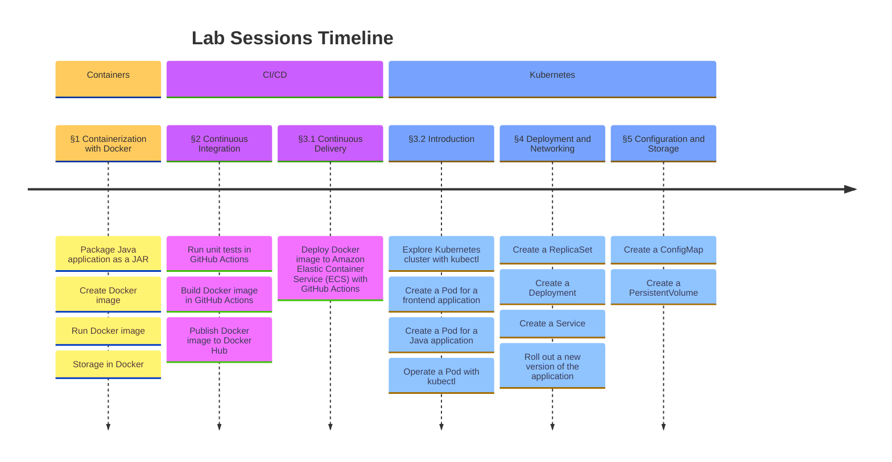

# Assignments

Welcome to the lab sessions! This is a mono-repository for the assignments of the course "Software Containerization and Orchestration" for the students of [ESIGELEC](https://esigelec.fr), majoring in "Ingenierie des Services du Numerique" (ISN). It includes 3 sections, 5 lab sessions, and is composed of different key objectives as described below:



For students attempting this course, the description of each lab session is not immediately available. It will be distributed to you under the `docs/` directory as a pull request, right before the beginning of a lab session. The answers to that lab session will be distributed at the beginning of the next chapter.

## Installation

### Docker Desktop

Docker Desktop is required for the lab sessions of this course. If you use a computer from ESIGELEC laboratory, the Docker Desktop is preinstalled. But if you use your personal computer, you need to download the Docker Desktop from the official website of Docker, see <https://www.docker.com/products/docker-desktop/>. You can verify if the command line tool `docker` is available in your terminal and verify its version using the following commands:

```sh
type docker
#docker is /Users/minconghuang/.docker/bin/docker

docker --version
#Docker version 26.1.4, build 5650f9b
```

> [!WARNING]
> For any computer from ESIGELEC laboratory, you don't have permissions to install software yourselves. Please contact the teacher if you encounter any difficulties.

### Kubernetes

Kubernetes has many distributions. For this course, we use the Kubernetes feature embedded in Docker Desktop. To enable this, you need to go to the Docker Desktop's settings and click "Enable Kubernetes". Note that this feature is only useful for lab sessions 3, 4, and 5 when practicing Kubernetes-related skills. It does not need to be enabled for lab sessions 1 and 2.


You can verify if the command line tool `kubectl` is available in your terminal and verify its version using the following commands:

```sh
type kubectl
#kubectl is /Users/minconghuang/.docker/bin/kubectl

kubectl version
#Client Version: v1.29.2
#Kustomize Version: v5.0.4-0.20230601165947-6ce0bf390ce3
#Server Version: v1.29.2
```

### Others

You are also expected to have these command line tools: `mvn`, `javac`, `git`, `curl`
