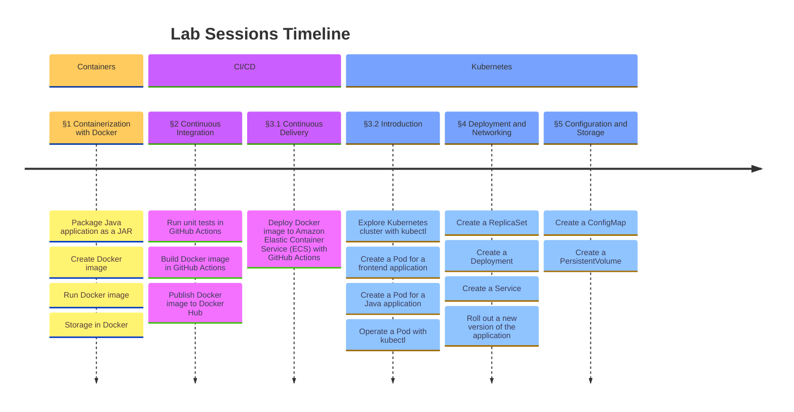

# Assignments

Welcome to the lab sessions! This is a mono-repository for the assignments of the course "Software Containerization and Orchestration" for the students of [ESIGELEC](https://esigelec.fr), majoring in "Ingenierie des Services du Numerique" (ISN). It includes 3 sections, 5 lab sessions, and is composed of different key objectives as described below:



## Report Submission

For students attempting this course, the description of each lab session is available under the `docs/` directory, such as `lab-1.md`. For each report, you need to fill in the answers in the document in place in the answer areas. Or, you need to provide relevant code snippets in your Git repository following the instructions. The answers to each lab session will be distributed at the beginning of the next chapter, so the deadline for submitting your lab report is the beginning of the next session. The deadline for the last lab session will be the 1 Dec 2024 at midnight. Please complete everything before the deadline. All submissions after the deadline won't be taken into account.

The score of the course is calculated based on the scores of the lab sessions, where each lab session is equally weighted. Each lab session has 20 points and the final score of the module is the average of the 5 lab sessions. For example, if you have 13, 17, 15, 14, and 16 for the 5 lab sessions, then the final score will be 15. There is no exam at the end of the course.

$$
\text{Score} = \frac{13 + 17 + 15 + 14 + 16}{5} = \frac{75}{5} = 15
$$

> [!NOTE]
>
> Please do not start the lab session in advance because the content of the lab is related to the lecture, so you should follow the lecture before getting started. Also, the content of the lab may be modified.

If you are motivated to go further, you are encouraged to apply the knowledge learned from this course in other courses: Node.js, Frameworks, Integration Project, PL/SQL, AI with Python, PING, etc. You can write down your analysis and your results in the lab reports as an appendix and earn up to 5 points for that session. This can be done before the end of the year (31 Dec 2024).

## Installation

### Docker Desktop

Docker Desktop is required for the lab sessions of this course. If you use a computer from ESIGELEC laboratory, the Docker Desktop is preinstalled. But if you use your personal computer, you need to download the Docker Desktop from the official website of Docker, see <https://www.docker.com/products/docker-desktop/>. You can verify if the command line tool `docker` is available in your terminal and verify its version using the following commands:

```sh
type docker
#docker is /Users/minconghuang/.docker/bin/docker

docker --version
#Docker version 26.1.4, build 5650f9b
```

> [!WARNING]
> For any computer from ESIGELEC laboratory, you don't have permissions to install software yourselves. Please contact the teacher if you encounter any difficulties.

### Kubernetes

Kubernetes has many distributions. For this course, we use the Kubernetes feature embedded in Docker Desktop. To enable this, you need to go to the Docker Desktop's settings and click "Enable Kubernetes". Note that this feature is only useful for lab sessions 3, 4, and 5 when practicing Kubernetes-related skills. It does not need to be enabled for lab sessions 1 and 2.


You can verify if the command line tool `kubectl` is available in your terminal and verify its version using the following commands:

```sh
type kubectl
#kubectl is /Users/minconghuang/.docker/bin/kubectl

kubectl version
#Client Version: v1.29.2
#Kustomize Version: v5.0.4-0.20230601165947-6ce0bf390ce3
#Server Version: v1.29.2
```

> [!TIP]
> Use button "Reset Kubernetes Cluster" of Docker Desktop to clear all existing objects of the cluster. This can be useful if you want to start from scratch, specially when you use a desktop from the school or when you messed up the cluster with incorrect operations. It only takes a few seconds to complete.

> [!TIP]
> To facilitate your operations, you can enable the shell completion for your OS. Visit the official guide [kubectl completion | Kubernetes](https://kubernetes.io/docs/reference/kubectl/generated/kubectl_completion/) for the detailed instructions. You can also add an alias `k` for `kubectl` so that you don't have to type the entire command.
>
> Bash / Zsh:
>
> ```sh
> alias k=kubectl
> ```
>
> PowerShell:
>
> ```powershell
> Set-Alias k kubectl
> ```

### Others

You are also expected to have these command line tools: `mvn`, `javac`, `git`, `curl`

## Discussions

If you have any questions or feedback for this course, please use the [discussions](https://github.com/orgs/mincong-classroom/discussions) of GitHub. I would love to hear from you!
