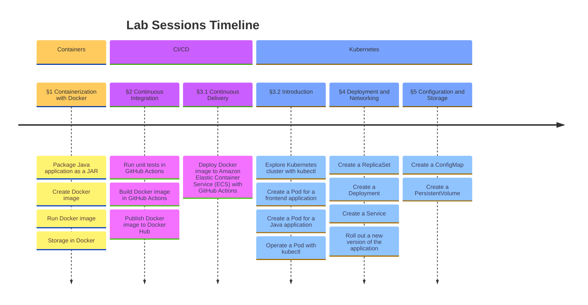

# containers-template

This is a template repository for the assignments of the course "Software Containerization and Orchestration" for the students of [ESIGELEC](https://esigelec.fr).

```mermaid
%%{
    init: {
        'logLevel': 'debug',
        'theme': 'base'
    }
}%%
timeline
    title Lab Sessions Timeline
    section Containers
        §1 Containerization with Docker
            : Package Java application as a JAR
            : Create Docker image
            : Run Docker image
            : Storage in Docker
    section CI/CD
        §2 Continuous Integration
            : Run unit tests in GitHub Actions
            : Build Docker image in GitHub Actions
            : Publish Docker image to Docker Hub
        §3.1 Continuous Delivery
            : Deploy Docker image to Amazon Elastic Container Service (ECS) with GitHub Actions
    section Kubernetes
        §3.2 Introduction
            : Explore Kubernetes cluster with kubectl
            : Create a Pod for a frontend application
            : Create a Pod for a Java application
            : Operate a Pod with kubectl
        §4 Deployment and Networking
            : Create a ReplicaSet
            : Create a Deployment
            : Create a Service
            : Roll out a new version of the application
        §5 Configuration and Storage
            : Create a ConfigMap
            : Create a PersistentVolume
```
