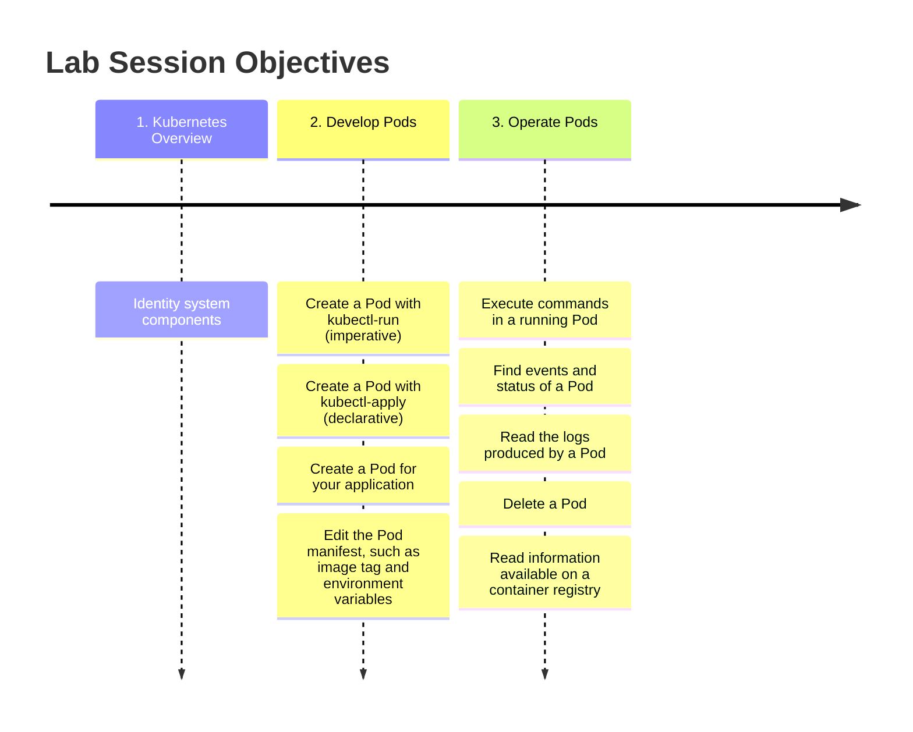

# Pods in Kubernetes

Lab Session 2 - 21 Oct, 2025

## Introduction

The goal of this lab session is to train your skills related to Pod and
`kubectl`. It lets you practice Pod creation, your ability to read and
edit Kubernetes manifests in YAML, operate Pods using `kubectl`, etc.



To submit the answers to this lab session, please fill in your answers
in this document in place. This should be done before the beginning of
the next course.

> [!NOTE]
> You need to enable the Kubernetes feature in Docker Desktop.
> See the README of the Git repository for more details.

## Exercise 1 - Kubernetes Overview

Observe the default containers started by Kubernetes using the command
`kubectl get pods --all-namespaces`. Then, try to identify them in the
cluster architecture diagram below. You don’t have to write down the
mappings between the diagram and the output of the `kubectl` command,
but you need to paste the results of the `kubectl` command here.


  

``` sh
# TODO: paste the output of kubectl command
```

  

In the diagram above, there are 2 worker nodes and one control-plane
node (master node). How many nodes do you have on your machine? What is
the name of the node?

  

``` sh
# TODO: enter command and results
```

  

## Exercise 2 - Create a nginx Pod (kubectl-run)

Create a pod using the `kubectl run` command with the `nginx` Docker
image, you should name the pod “nginx” and publish the container’s port
80 to the Kubernetes cluster.

  

``` sh
# TODO: enter your command here
```

  

Ensure that the nginx container is running. Establish a connection with
the container using the `kubectl port-forward pod/nginx 8080:80`, so
that you can access the content via the host port 8080. Then, open your
browser, visit <http://localhost:8080>, copy the content of the web page
and paste it below.

  

``` sh
# TODO: enter your command here
```

``` sh
# TODO: enter web page content here
```

  

Inspect the pod and describe its characteristics in the table below.
Hint: you can use the following commands:

- `kubectl describe pod nginx`
- `kubectl get pod nginx`
- `kubectl get pod nginx -o wide` with node information

or learn more commands from `kubectl` Quick Reference.
<https://kubernetes.io/docs/reference/kubectl/quick-reference/>

  

``` yaml
# TODO: fill these fields
container:
  image: # TODO
  port: # TODO
  state: # TODO
pod:
  labels: # TODO
  ip_address: # TODO
  namespace: # TODO
node:
  name: # TODO
```

  

Delete this pod using the `kubectl delete` command

  

``` sh
# TODO: enter the command here
```

  

## Exercise 3 - Create a nginx Pod (kubectl-apply)

Instead of using the `kubectl run` command, now you need to write a
manifest to describe the specification of the pod in a YAML file. Copy
the official example here:
<https://kubernetes.io/docs/concepts/workloads/pods/#using-pods>. Add
label `team=${team}` to the definition, where `team` is the value of
your team in lower case. Persist the YAML file in your Git repository
under the path `${git_repo}/k8s/pod-nginx.yaml`.

Describe the full `kubectl apply` command used:

  

``` sh
# NOTE: write the answer to file "${REPO}/k8s/pod-nginx.yaml"
```

  

Prove that the pod is running:

  

``` sh
# TODO: enter command and results here
```

  

## Exercise 4 - Create a Java Pod

Write a Kubernetes manifest (YAML file) to create a pod for the Java
Docker image “spring-petclinic” made in the previous lab sessions. This
pod should also be called a “spring-petclinic”, running on the container
port 8080, having labels `app=spring-petclinic` and `team=${team}`.
Persist the manifest in your Git repository under the path
`${git_repo}/k8s/pod-pet-clinic.yaml`.

  

  

## Exercise 5 - Operate a Java Pod

In this exercise, you are going to use `kubectl exec` to connect to the
container and inspect it.

Connect to the pod and then use `ps aux` to describe the running Java
process inside the Java pod. Provide the process ID (PID) and the path
of the JAR inside the container.

  

``` sh
# TODO: enter command and results here
```

  

What is the version of Java used?

  

``` sh
# TODO: enter command and results here
```

  

Can you inspect the logs of the Java container: what command would you
use?

  

``` sh
# TODO: enter command and results here
```

  

Can you find this java pod using the `kubectl get` command with a label
selector? You have defined some labels in the previous exercise. See
more information about labels and selectors at
https://kubernetes.io/docs/concepts/overview/working-with-objects/labels/

  

``` sh
# TODO: enter command and results here
```

  

## Exercise 6 - Fix a broken Pod

Create a Pod using the following command:

``` sh
kubectl apply -f https://mincong.io/esigelec/lab/broken-pod.yaml
```

Is the Pod running? Please troubleshoot and make sure that the Pod is
running at the end.

  

``` sh
# TODO: enter commands and analysis; new Pod manifest should be stored under
#   ${REPO}/k8s/pod-hello-server.yaml
```

``` sh
# TODO: prove that the Pod is running
```
