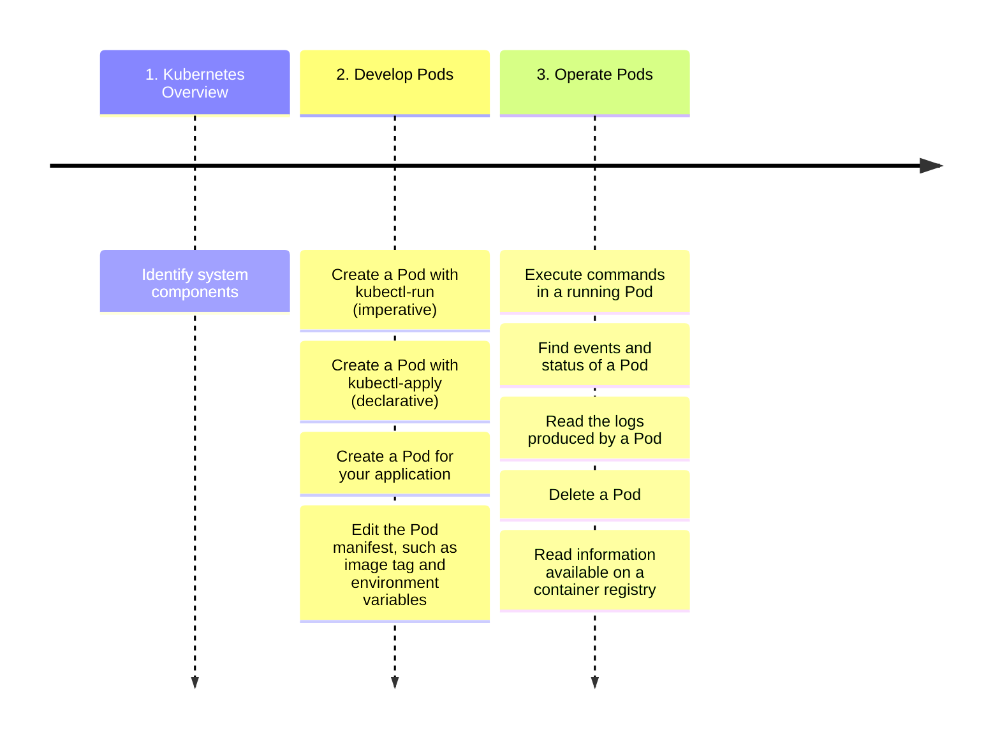

# Pods in Kubernetes

Lab Session 2 - 23 Oct, 2026

## Introduction

The goal of this lab session is to train your skills related to Pod and
`kubectl`. It lets you practice Pod creation, your ability to read and
edit Kubernetes manifests in YAML, operate Pods using `kubectl`, etc.


``` mermaid
timeline
    1. Kubernetes Overview
        : Identify system components
    2. Develop Pods
        : Create a Pod with kubectl-run (imperative)
        : Create a Pod with kubectl-apply (declarative)
        : Create a Pod for your application
        : Edit the Pod manifest, such as image tag and environment variables
    3. Operate Pods
        : Execute commands in a running Pod
        : Find events and status of a Pod
        : Read the logs produced by a Pod
        : Delete a Pod
        : Read information available on a container registry
```

To submit the answers to this lab session, please fill in your answers
in this document in place. This should be done before the beginning of
the next course.

## Before you start - Create the Kubernetes cluster

This lab session is the first one that uses Kubernetes: Docker Desktop
runs a Kubernetes cluster on your machine. Create it first.

1.  In Docker Desktop, open the **Kubernetes** view, and select **Create
    cluster**.
2.  Choose the cluster type **kind**, with one node and the default
    version. If kind is not offered, choose **Kubeadm**. Both work for
    this lab session: only some names differ, such as the name of the
    node. One node is enough, and each node takes more memory.
3.  Select **Create**, and wait until the cluster is running.

If the Kubernetes view already shows a running cluster, keep it, and go
to the check below. On Linux, Docker Desktop doesn’t install `kubectl`:
install it first, see <https://kubernetes.io/docs/tasks/tools/>.

Check the cluster in a terminal:

``` sh
kubectl config current-context
kubectl get nodes
```

The current context must be `docker-desktop`, and the list of nodes must
show one node, with the status `Ready`.

  

## Exercise 1 - Kubernetes Overview

Observe the default Pods started by Kubernetes using the command
`kubectl get pods --all-namespaces`. Then, try to identify them in the
cluster architecture diagram below. You don’t have to write down the
mappings between the diagram and the output of the `kubectl` command,
but you need to paste the results of the `kubectl` command here.


  

``` sh
# TODO: paste the output of kubectl command
```

  

In the diagram above, there are 2 worker nodes and one control-plane
node. How many nodes do you have on your machine? What is the name of
the node?

  

``` sh
# TODO: enter command and results
```

  

## Exercise 2 - Create a nginx Pod (kubectl-run)

Create a Pod named “nginx” with the `kubectl run` command, using the
`nginx` Docker image, and declare the container port 80.

  

``` sh
# TODO: enter your command here
```

  

Ensure that the nginx container is running. Establish a connection with
the container using the `kubectl port-forward pod/nginx 8080:80`, so
that you can access the content via the host port 8080. Then, open your
browser, visit <http://localhost:8080>, copy the content of the web page
and paste it below.

The command keeps running while the connection is open: leave it
running. Run the next commands in another terminal. Press Ctrl+C to stop
it.

  

``` sh
# TODO: enter your command here
```

``` sh
# TODO: enter web page content here
```

  

Inspect the pod and describe its characteristics in the table below.
Hint: you can use the following commands:

- `kubectl describe pod nginx`
- `kubectl get pod nginx`
- `kubectl get pod nginx -o wide` with node information

or learn more commands from `kubectl` Quick Reference.
<https://kubernetes.io/docs/reference/kubectl/quick-reference/>

  

``` yaml
# TODO: fill these fields
container:
  image: # TODO
  port: # TODO
  state: # TODO
pod:
  labels: # TODO
  ip_address: # TODO
  namespace: # TODO
node:
  name: # TODO
```

  

Delete this pod using the `kubectl delete` command

  

``` sh
# TODO: enter the command here
```

  

## Exercise 3 - Create a nginx Pod (kubectl-apply)

Instead of using the `kubectl run` command, now you need to write a
manifest to describe the specification of the pod in a YAML file. Copy
the official example here:
<https://kubernetes.io/docs/concepts/workloads/pods/#using-pods>, and
use the image `nginx`, the latest version, instead of `nginx:1.14.2`.
Add label `team=${team}` to the definition, where `team` is the value of
your team in lower case. Persist the YAML file in your Git repository
under the path `${REPO_ROOT}/k8s/lab-2/pod-nginx.yaml`.

Describe the full `kubectl apply` command used:

  

``` sh
# NOTE: write the manifest to file "${REPO_ROOT}/k8s/lab-2/pod-nginx.yaml"
# TODO: enter the kubectl apply command here
```

  

Prove that the pod is running:

  

``` sh
# TODO: enter command and results here
```

  

## Exercise 4 - Create a Java Pod

Write a Kubernetes manifest (YAML file) to create a pod for the Java
Docker image that your team published in the previous lab session:
`mincongclassroom/spring-petclinic-${team}:1.1.0`, the version with your
team name in the footer (Lab Session 1, Exercise 6). This Pod should
also be named `spring-petclinic`. It runs on the container port 8080,
and has the labels `app=spring-petclinic` and `team=${team}`. Persist
the manifest in your Git repository under the path
`${REPO_ROOT}/k8s/lab-2/pod-petclinic.yaml`.

  

``` sh
# NOTE: write the manifest to file "${REPO_ROOT}/k8s/lab-2/pod-petclinic.yaml"
```

  

Apply the manifest, and prove that the Pod is running:

  

``` sh
# TODO: enter the commands and results here
```

  

## Exercise 5 - Operate a Java Pod

In this exercise, you are going to use `kubectl exec` to connect to the
container and inspect it.

Connect to the pod with an interactive shell, using `kubectl exec -it`,
and then use `ps aux` to describe the running Java process inside the
Java pod. Provide the process ID (PID) and the path of the JAR inside
the container.

  

``` sh
# TODO: enter command and results here
```

  

What is the version of Java used?

  

``` sh
# TODO: enter command and results here
```

  

Can you inspect the logs of the Java container: what command would you
use?

  

``` sh
# TODO: enter command and results here
```

  

Can you find this Java pod using the `kubectl get` command with a label
selector? You have defined some labels in the previous exercise. See
more information about labels and selectors at
https://kubernetes.io/docs/concepts/overview/working-with-objects/labels/

  

``` sh
# TODO: enter command and results here
```

  

## Exercise 6 - Fix a broken Pod

Create a Pod using the following command:

``` sh
kubectl apply -f https://mincong.io/esigelec/lab/2/broken-pod.yaml
```

Is the Pod running? Please troubleshoot and make sure that the Pod is
running at the end.

Keep your fix in your Git repository: first, download the manifest into
`${REPO_ROOT}/k8s/lab-2/pod-team-info-server.yaml`, from the root
directory of the repository.

``` sh
# macOS, Linux
curl -o k8s/lab-2/pod-team-info-server.yaml https://mincong.io/esigelec/lab/2/broken-pod.yaml
```

``` powershell
# Windows (PowerShell)
Invoke-WebRequest -Uri https://mincong.io/esigelec/lab/2/broken-pod.yaml -OutFile k8s/lab-2/pod-team-info-server.yaml
```

In PowerShell, use the second command: there, `curl` can be another name
of `Invoke-WebRequest`, which has other options.

  

``` sh
# NOTE: write the fixed manifest to file "${REPO_ROOT}/k8s/lab-2/pod-team-info-server.yaml"
# TODO: enter the commands and the analysis here
```

``` sh
# TODO: prove that the Pod is running
```
